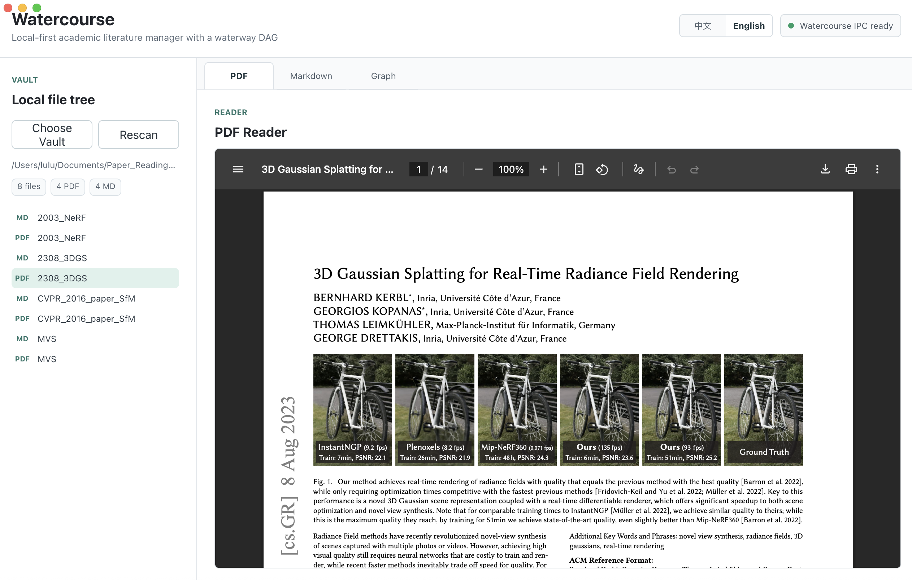
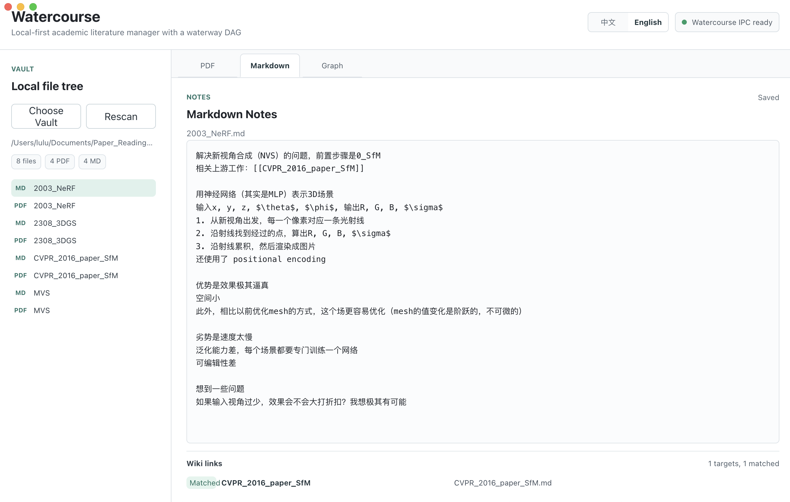
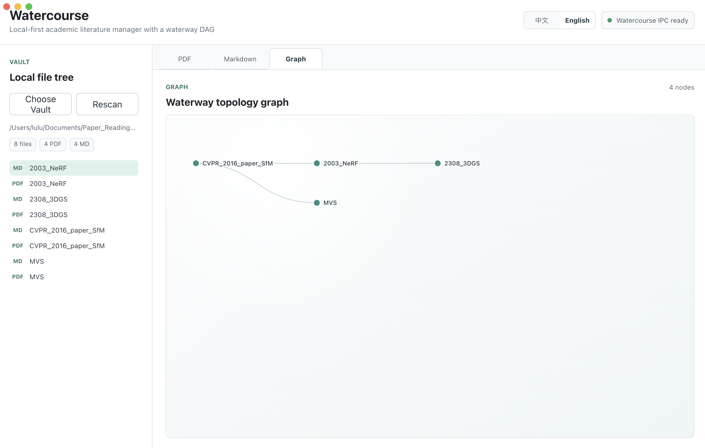

# Watercourse

[English](#english) | [中文](#中文)

---

## English

Watercourse is a local-first academic literature manager for PDFs, Markdown notes, and a left-to-right DAG graph of literature relationships.

It is designed for researchers who want to read papers, write notes, and map how ideas flow from upstream work to downstream work without sending their data to a cloud service.

**Current Status:** MVP. The core local workflow is available, and macOS packaging is currently supported.

### Features

**PDF Reading**

Open local PDFs from a selected Vault and read them inside the app.



**Markdown Notes**

Write paired Markdown notes for papers. Wiki links such as `[[Paper A]]` are parsed as upstream relationships.



**Graph View**

Visualize literature relationships as a left-to-right directed acyclic graph. Upstream papers stay on the left; downstream papers flow to the right.



### Download the macOS App

Most users should download the `.dmg` installer from GitHub Releases instead of building from source:

```text
https://github.com/<your-github-name>/Watercourse/releases/latest
```

Choose the build that matches your Mac:

- Apple Silicon: `Watercourse-0.1.0-arm64.dmg`
- Intel Mac: `Watercourse-0.1.0-x64.dmg`

Release artifacts are generated locally under `release/mac/`, but they are not committed to the repository. Upload the `.dmg` files to GitHub Releases when publishing a version.

### Install Dependencies

```bash
npm install
```

### Run in Development

```bash
npm run dev
```

If your shell cannot find `npm`, and you use the same local nvm setup as this project machine:

```bash
PATH=$HOME/.nvm/versions/node/v22.22.3/bin:$PATH npm run dev
```

### Build macOS Packages

Stage 10 currently targets macOS only.

```bash
npm run package:mac
```

The installer artifacts are written to:

```text
release/mac/
```

Architecture-specific builds are also available:

```bash
npm run package:mac:arm64
npm run package:mac:x64
```

### Data Locations

Watercourse keeps source code, user files, and app data separate:

- **App Source:** this repository.
- **User Vault:** the local folder selected by the user. It contains PDFs, Markdown notes, and attachments.
- **App Data:** Electron `userData`, including SQLite, settings, cache, and logs.

User PDFs and Markdown notes are never stored inside the installer.

### Current Limitations

- The app is unsigned for local MVP testing.
- macOS is the only packaging target currently verified.
- Watercourse is local-first and does not provide cloud sync.
- The current graph and editor workflows are MVP-level and will continue to evolve.

### License

Watercourse is released under the MIT License. See [LICENSE](LICENSE) for details.

---

## 中文

Watercourse 是一个本地优先的学术文献管理工具，用于阅读 PDF、编写 Markdown 笔记，并用从左到右的 DAG 图谱展示文献之间的演进关系。

它面向希望在本地管理论文、笔记和知识脉络的研究者。用户数据不需要上传到云端，文献库由用户自己选择本地文件夹保存。

**当前状态：** MVP。核心本地工作流已经可用，目前支持 macOS 打包。

### 功能

**PDF 阅读**

从用户选择的 Vault 中打开本地 PDF，并在应用内阅读。


**Markdown 笔记**

为论文编写配套 Markdown 笔记。形如 `[[文献A]]` 的双链会被解析为上游文献关系。


**图谱视图**

将文献关系可视化为从左到右的有向无环图。上游文献位于左侧，下游文献向右流动。


### 下载 macOS 应用

大多数用户应该直接从 GitHub Releases 下载 `.dmg` 安装包，而不是从源码构建：

```text
https://github.com/<your-github-name>/Watercourse/releases/latest
```

根据 Mac 芯片选择对应版本：

- Apple Silicon：`Watercourse-0.1.0-arm64.dmg`
- Intel Mac：`Watercourse-0.1.0-x64.dmg`

发布包会在本地生成到 `release/mac/`，但不应该提交进仓库。正式发布版本时，把 `.dmg` 文件上传到 GitHub Releases 即可。

### 安装依赖

```bash
npm install
```

### 运行开发版

```bash
npm run dev
```

如果当前 shell 找不到 `npm`，并且你使用的是这台开发机上的 nvm 路径，可以运行：

```bash
PATH=$HOME/.nvm/versions/node/v22.22.3/bin:$PATH npm run dev
```

### 打包 macOS 安装包

Stage 10 当前只做 macOS。

```bash
npm run package:mac
```

安装包产物会输出到：

```text
release/mac/
```

也可以分别生成指定架构的安装包：

```bash
npm run package:mac:arm64
npm run package:mac:x64
```

### 数据目录说明

Watercourse 会严格区分源码、用户文献库和应用内部数据：

- **App Source：** 当前代码仓库。
- **User Vault：** 用户选择的本地文件夹，用于保存 PDF、Markdown 笔记和附件。
- **App Data：** Electron 的 `userData` 目录，用于保存 SQLite、设置、缓存和日志。

用户的 PDF 和 Markdown 笔记不会被打进安装包。

### 当前限制

- 当前应用是未签名的 MVP 本地测试包。
- 目前主要验证 macOS，暂未做 Windows / Linux 打包。
- Watercourse 是本地优先应用，当前不提供云同步。
- 当前图谱和编辑器工作流仍处于 MVP 阶段，后续会继续完善。

### 许可证

Watercourse 使用 MIT License 发布。详情见 [LICENSE](LICENSE)。
